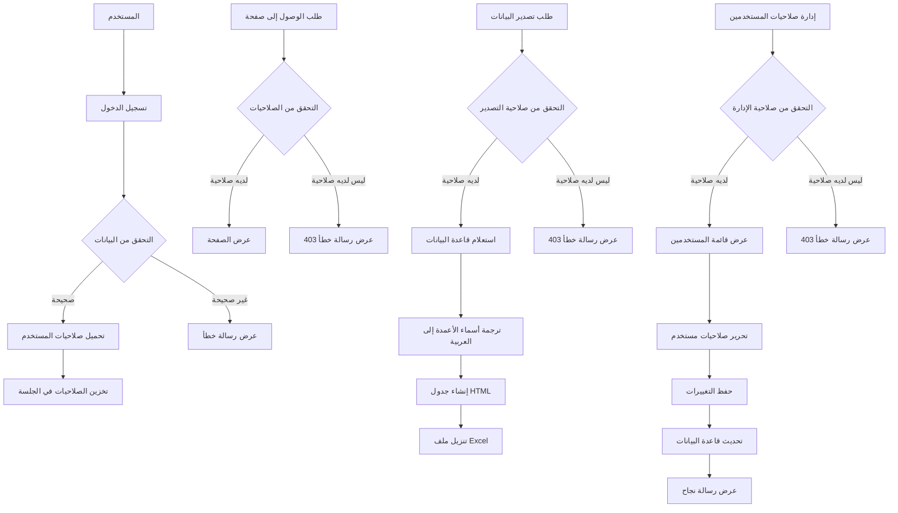
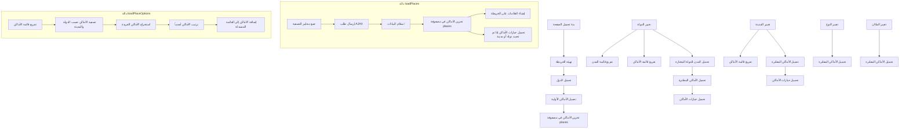
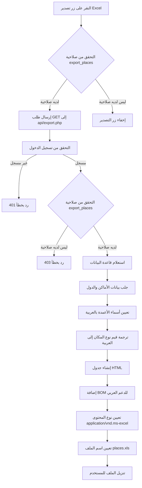
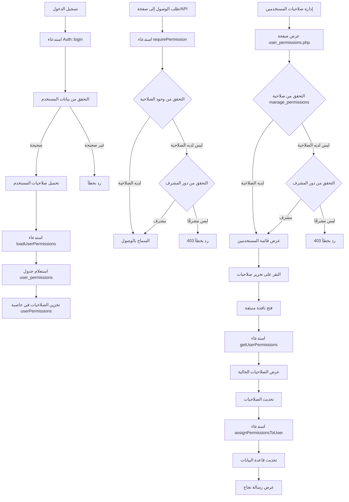

# مخطط انسيابي لنظام إدارة المواقع الجغرافية

## مخطط انسيابي لنظام الصلاحيات وتصدير البيانات

## مخطط انسيابي لتصفية الأماكن في صفحة الخريطة

## مخطط انسيابي لعملية تصدير البيانات إلى Excel

## مخطط انسيابي لنظام الصلاحيات

## شرح تدفق البيانات

1. **بدء تحميل الصفحة**:
   - تهيئة الخريطة باستخدام Leaflet
   - تحميل قائمة الدول من API
   - تحميل الأماكن الأولية (بدون تصفية)
   - تخزين الأماكن في مصفوفة `places` للاستخدام اللاحق

2. **تغيير الدولة**:
   - تفريغ قائمة المدن وقائمة الأماكن
   - تحميل المدن للدولة المختارة
   - تحميل الأماكن المفلترة حسب الدولة
   - تحميل خيارات الأماكن المتاحة للدولة المختارة

3. **تغيير المدينة**:
   - تفريغ قائمة الأماكن
   - تحميل الأماكن المفلترة حسب الدولة والمدينة
   - تحميل خيارات الأماكن المتاحة للمدينة المختارة

4. **تغيير النوع أو المكان**:
   - تحميل الأماكن المفلترة حسب المعايير المحددة

5. **دالة loadPlaces**:
   - جمع معايير التصفية (الدولة، المدينة، النوع، المكان)
   - إرسال طلب AJAX إلى API لجلب الأماكن المفلترة
   - استلام البيانات وتخزينها في مصفوفة `places`
   - إنشاء العلامات على الخريطة
   - استدعاء دالة `loadPlaceOptions` إذا تم تحديد دولة أو مدينة

6. **دالة loadPlaceOptions**:
   - تفريغ قائمة الأماكن وإضافة خيار "الكل"
   - تصفية الأماكن حسب الدولة والمدينة المحددة
   - استخراج الأماكن الفريدة (الاسم والمعرف)
   - ترتيب الأماكن أبجدياً
   - إضافة الأماكن إلى القائمة المنسدلة