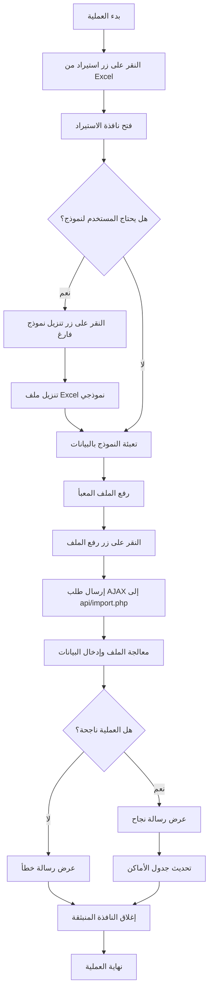
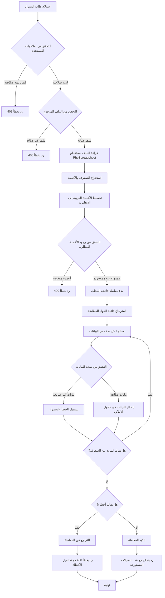
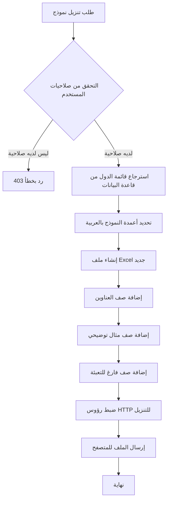

# مخطط انسيابي لعملية استيراد الأماكن من ملف Excel

## المخطط الانسيابي الرئيسي

## مخطط معالجة الملف في الخادم

## مخطط تنزيل النموذج الفارغ

## شرح تدفق البيانات

1. **واجهة المستخدم**:
   - يبدأ المستخدم بالنقر على زر "استيراد من Excel" في صفحة الأماكن
   - تظهر نافذة منبثقة تتيح للمستخدم تنزيل نموذج فارغ أو رفع ملف معبأ
   - بعد رفع الملف، يتم إرسال طلب AJAX إلى الخادم
   - يتم عرض رسالة نجاح أو فشل بناءً على استجابة الخادم

2. **معالجة الملف في الخادم**:
   - يتحقق الخادم من صلاحيات المستخدم وصحة الملف المرفوع
   - يتم قراءة الملف وتخطيط الأعمدة العربية إلى الحقول الإنجليزية
   - يتم التحقق من صحة البيانات ومطابقة أسماء الدول بمعرفاتها
   - يتم إدخال البيانات الصحيحة في قاعدة البيانات ضمن معاملة واحدة
   - يتم إرسال استجابة JSON تحتوي على حالة العملية وعدد السجلات المستوردة

3. **تنزيل النموذج الفارغ**:
   - يتحقق الخادم من صلاحيات المستخدم
   - يتم استرجاع قائمة الدول من قاعدة البيانات
   - يتم إنشاء ملف Excel يحتوي على الأعمدة المطلوبة وصف مثال توضيحي
   - يتم إرسال الملف للمتصفح للتنزيل